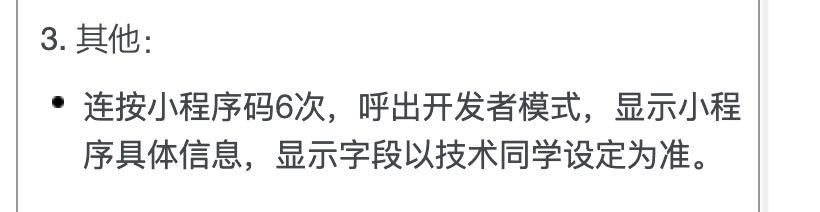

# [WeChat applet]-repeatClick
**需求如图所示**



微信小程序开发支持单击（bindtap）、长按（bindlongtap）

开发过程中参考了[https://github.com/lanfeng1993/TapDemo](https://github.com/lanfeng1993/TapDemo)

**思考：**

任意连续六次的点击满足在三秒内，即触发跳转事件。

**代码：**
```
<!--pages/index.wxml-->

<view class="repeatClick" bindtap="repeatClick">
  <label class="showTxt">click here!!!</label>
</view>


/* pages/index.wxss */
.repeatClick {
  display: flex;
  flex-direction: column;
  align-items: center;
  margin-top: 200px;
}
.showTxt {
  border: 1px solid black;
}


// pages/index.js
const CLICK_COUNTS = 6;                   // 规定点击次数
const CLICK_INTERVAL = 3000;              // 有效点击间隔时间

Page({

  /**
   * 页面的初始数据
   */
  data: {
    clickTimes: [],                       // 多次点击time记录
  },


  /**
   * 
   * 规定间隔时间内，多次点击触发事件
   */
  repeatClick: function(e){
    var that = this;
    var clilckTimesArr = that.data.clickTimes;
    if (that.data.clickTimes.length < CLICK_COUNTS) {

      clilckTimesArr.push(e.timeStamp);
      that.setData({
        clickTimes: clilckTimesArr,
      })
    } else {
      if (e.timeStamp - that.data.clickTimes[0] < CLICK_INTERVAL) {
        wx.showToast({
          title: '事件触发成功啦',
          icon: 'success',
        })
        return;
      } else {
        clilckTimesArr.shift();
        clilckTimesArr.push(e.timeStamp);
        that.setData({
          clickTimes: clilckTimesArr,
        })
      }
    }

  },
  /**
   * 生命周期函数--监听页面加载
   */
  onLoad: function (options) {

  },

  /**
   * 生命周期函数--监听页面初次渲染完成
   */
  onReady: function () {

  },

  /**
   * 生命周期函数--监听页面显示
   */
  onShow: function () {
    this.setData({
      clickTimes: [],
    })
  },

  /**
   * 生命周期函数--监听页面隐藏
   */
  onHide: function () {

  },

  /**
   * 生命周期函数--监听页面卸载
   */
  onUnload: function () {

  },

  /**
   * 页面相关事件处理函数--监听用户下拉动作
   */
  onPullDownRefresh: function () {

  },

  /**
   * 页面上拉触底事件的处理函数
   */
  onReachBottom: function () {

  },

  /**
   * 用户点击右上角分享
   */
  onShareAppMessage: function () {

  }
})
```