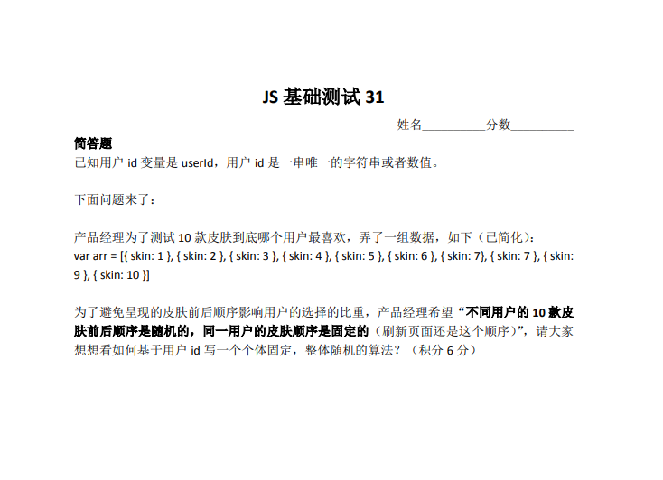

# [Test14]JS-31
JS基础小测31

**题目如图所示**




## 我的思考：

1. 看不懂题意，完全没思绪，Google了很多资料，看到一篇凹凸实验室的文章（https://aotu.io/notes/2016/04/14/math-random/ ），理解了题目的意义和其未来应用场景。
2.	全排列，然后利用随机种子❌，10的阶乘的时间复杂度过高，放弃
3.	参考了其他人的解答，得到自己的处理代码（copy是最笨最好的学习方式）


## 我的代码：
``` javascript
var arr =[ { skin: 1 }, { skin: 2 }, { skin: 3 }, { skin: 4 }, { skin: 5 }, { skin: 6 }, { skin: 7 }, { skin: 8 }, { skin: 9 }, { skin: 10 }];
var id = '3789247'
var seed = parseInt( id );
var randomStr =  Math.sin(seed).toString().substr(2,10);
arr.forEach(function(e,i){
    e.seed = +randomStr.slice(i, i + 2)
})
arr.sort(function(a, b){
    return a.seed - b.seed;
})
console.log(arr);
// 代码中存在的问题，①id可能是一串字符串，不一定是数值；②10最好用arr.length协作

```
## 张老师直播反馈：
1.	使用localStorage存储的问题，产品经理希望测试的数据不是一成不变的，如果以后新增新的随机排序，或者数据变化，就很麻烦。
2. // 种子随机数生成方法
function rnd( seed ){
seed = ( seed * 9301 + 49297 ) % 233280; 
return seed / ( 233280.0 ) * 10e17;
};
3. 上面的方法需要把字母转换成数值，可以借助charCodeAt()方法把字母变成数值。
4. Math.cos()/Math.sin()也可以用来生成随机数。
5. 直接在sort中Math.random() - 0.5随机并不是完全随机，因为浏览器此时的排序算法是插值算法，详见 https://segmentfault.com/a/1190000011521009。
6. 很多人没意识到的，测试的排序数组可能会很长，超过生成的随机数，需要补全。
7. 看看其它算法：逆康托展开，大家可以学习学习。
## 我的学习：
1. 随机种子数
2. https://aotu.io/notes/2016/04/14/math-random/
3. 随机数-伪随机数，斐波那契法、线性同余法、梅森旋转算法等
4. 逆康托展开，如下代码是其他人的解答，很有参考价值
``` javascript
乘法散列+康托展开

//1!-10!阶乘
const fac=[ 1, 1, 2, 6, 24, 120, 720, 5040, 40320, 362880, 3628800 ]
//逆康托展开
let decantor=(index)=>{
    var quot,remain=index,result=[1,2,3,4,5,6,7,8,9,10],revId
    for(var i=0;i<9;i++){
        quot=parseInt(remain/fac[10-i-1])
        remain=remain%fac[10-i-1]
        revId=result.slice(i,10).sort((a,b)=>a-b)[quot]
        result[result.indexOf(revId)]=result[i]
        result[i]=revId
    }
    return result
}
//userId 要映射到 全排列=10！个槽中
let hash=(number)=>fac[10]*(0.6180339887*number%1)
//主函数
let getSkinByUserId=(userId)=>{
    userId=parseInt((userId+'').split('').map(v=>v.charCodeAt(0).toString(16)).join(''),16)%1e15
    return decantor(hash(userId)).map(v=>({skin:v}))
}

skin=getSkinByUserId(1)
console.log(skin)
```


